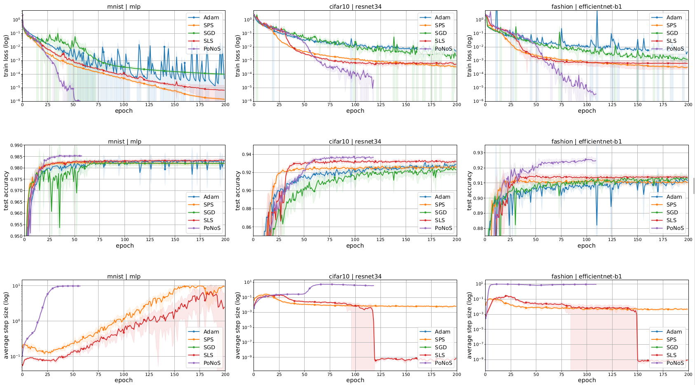

## PoNoS - POlyak NOnmonotone Stochastic line search [[arXiv]](https://arxiv.org/abs/2306.12747)

The first nonmonotone stochastic line search for training over-parameterized models.




### 0. PoNoS as a ```torch.optim.Optimizer```

The file ```PoNoS.py``` is a self contained class implementing our new algorithm PoNoS as torch.optim.Optimizer.
This optimizer can be easily integrated in any deep learning pipeline as shown in the example at the end of the file ```PoNoS.py```.

### 1. Installation

`pip install git+https:github.com/leonardogalli91/PoNoS.git`

or 

```
git clone git@github.com:leonardogalli91/PoNoS.git
pip install -r requirements.txt
```

### 2. Experiments

#### 2.1 Dataset

Set to ```True``` the options ```download``` in the file ```src/datasets.py```

#### 2.2 Launching experiments

`python trainval.py -e mnist_mlp -sb results/mnist_mlp -d data -r 1`

where `-e` is the experiment group, `-sb` is the result directory, and `-d` is the dataset directory.
The experiment group is referring to the key of the dict ```EXP_GROUPS```, that can be found in the file ```exp_configs.py```,
from that file it is possible to customize thoroughly the experiment. 

### 3. Plot Results

In the file ```plot.py``` set the variable ```savedir_base``` to point at the root directory where you saved the results, then run

`python plot.py -p mnist_mlp`


